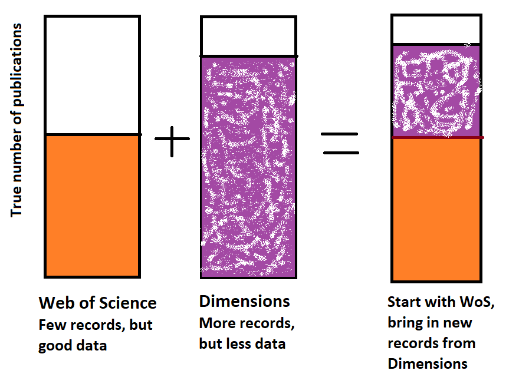

# combine_WoS_and_Dimensions
This script takes in a Web of Science export and a Dimensions export file, de-duplicates records, enchances Dimensions data, then combines them into one file

# Problem
Want to understand an institution's publishing activity (often looking at one particular publisher).
Analyzing metadata on scholarly outputs often requires a data export from one or more bibliographic databases. 

Each has their own pros and cons.

### Web of Science
Includes a critical data point (Corresponding Author, or in Web of Science terms, Reprint Author), but excludes entire journals through its restrictive indexing criteria.

Good data on each record, but by definition, incomplete number of records/rows

### Dimensions
Indexes much more widely and includes records from many more journals than Web of Science, but does not provide the critical Corresponding Author data

More records, but each record has less data

# This Project

This project attempts to combine the strengths of both these databases and arrive at a more complete picture of output (typically from an institution and/or with a specific publisher)

## First, Export Data

From Web of Science, select Export -> Excel -> Records from: 1 to XXX -> Full Record (includes the Reprint Author fields). Note the limit is 1000 per export, so you may need to do this multiple times and combine files.

From Dimensions, select Save/Export -> Export Results -> Export Full Record

## Next, change lines 28 and 31 to point to your data
## Also modify lines 65-68 to look for evidence of Corresponding Authors from your institution (currently set to Iowa State)

## Then, this script will:
### Read in **Web of Science** export file
- Keep only a subset of the columns
- Filter down to only certain Document Types ("Article" or "Review" (but not "Book Review"))
- Filter down to Iowa State University Corresponding Authors (CA)
- - keys off "Email Address" and "Reprint Address" columns
- Save off records with ISU CA and without ISU CA
- - Recommended to manually investigate records without ISU CA to make sure you're not missing something

### Read in **Dimensions** export file
- Keep only some columns
- Rename those columns to match WoS naming convention
- Filter down to only the "Article" document type
- - Document types defined for Dimensions from Crossref, lots of other garbage gets through here like Editorials, Corrections, Cover Pictures, etc. Use with care
- Use "DOI" column to check which DOIs we already have from Web of Science
- Save off new DOIs, present only in Dimensions export file

### Enrich Dimensions data
- The **biggest weakness** of Dimensions is that it doesn't always provide information on the Corresponding Author of each paper
- Use the "Addresses" column to look at affiliations of each author
- If all authors are from Iowa State University, then by definition the CA will be from ISU (I just can't tell *which* author it is)

### Combine
- Combine WoS data with Dimensions data using `pd.concat`
- Drop duplicate Article Titles, sometimes the same article can have two unique DOIs (preprint, International edition, etc)
- Flags possible non-Article types: Editorials, Letters, Cover Photos, etc to look at in more depth

## Next Steps / Future work
- Will still need to manually investigate those Dimensions records where the CA could not be determined
- Use DOI column to load the landing page of each, find CA and record
- Would be nice to use the WoS and Dimensions APIs to get the data instead of the manual exporting to Excel sheets
